# Session 01: Project Planning

I have decided to make a pcb card. 
Main Theme: Buri Buri Zaiimon's ID card style
Orientation: Portrait
Layout: 
front - school id card type (big image in a rectangle on top, few details and iconic quto below that)
back - nfc component + actual social links

(lowkey reconsidering the design, maybe would go for something cool hacker/coding theme => depedns on if i get a nice idea)

**Total time spent: 0.16 hours (10min)**

---
---

# Session 02: Setup EasyEDA + Start working on PCB Schematic

setup a new easy eda account (had to login multiple times for some reason, and then multiple times again while trying to create a new project)

referenced the pcb hacker card guide to:
- add the components from the "library" function
- match components that i added to the ones shown in the guide
- connect all components using the 'wiring' function (found out the shortcut to enable and disable wiring option (it is pressing 'w' and 'esc' respectively))

that was all for this session.

schematic image:

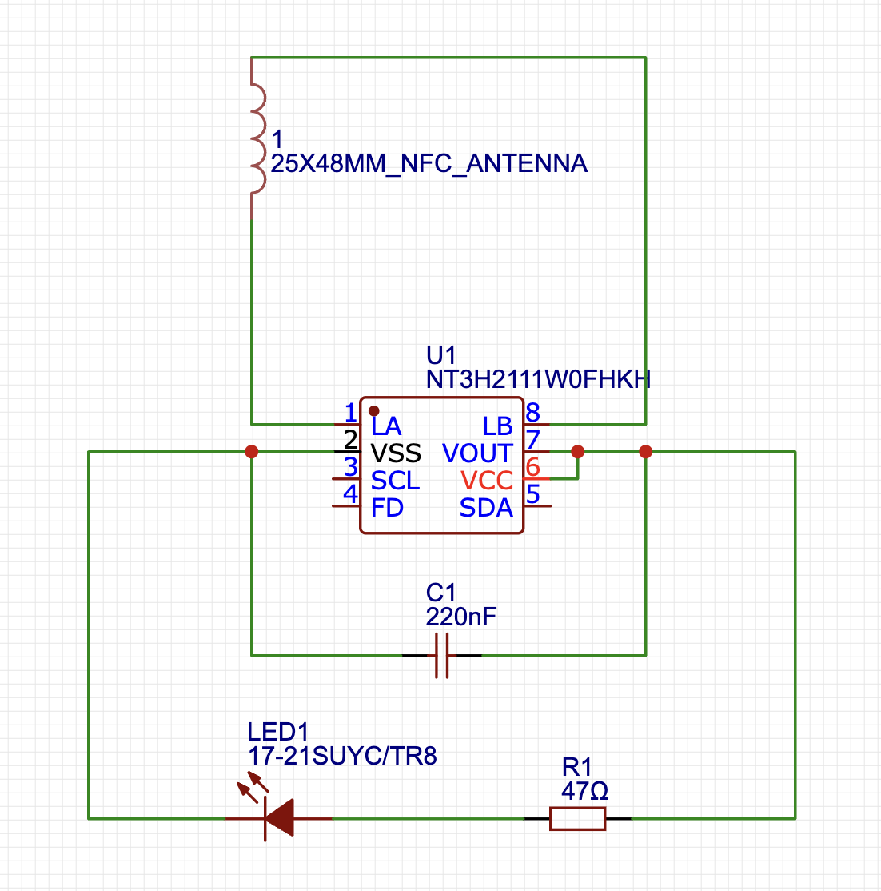

**Total time spent: 0.4 hours**

---
---

# Session 03: Starting working on actual PCB layout

completed the routing for all the components.
took me wayy too long. 
i first tried to do it on my own, couldn't do it => tried to use the auto-router --> very unaesthetic so removed it's routing => again tried to route on my own and couldn't do it :sob => tried auto-routing again, worse than last time --> undo again => again routed on my own (took a looonnnggg time but i was able to do it)

then i finally checked drc and there were 5 big red errors. resolved the unconnected components issue, couldn't resolve the other ones. 
asked in slack for help (in the #hardware channel huddle) ==> found that i can ignore it, became happy. also found out that 90deg routing is a no-no, so changed that and got it checked.

> drc errors
> 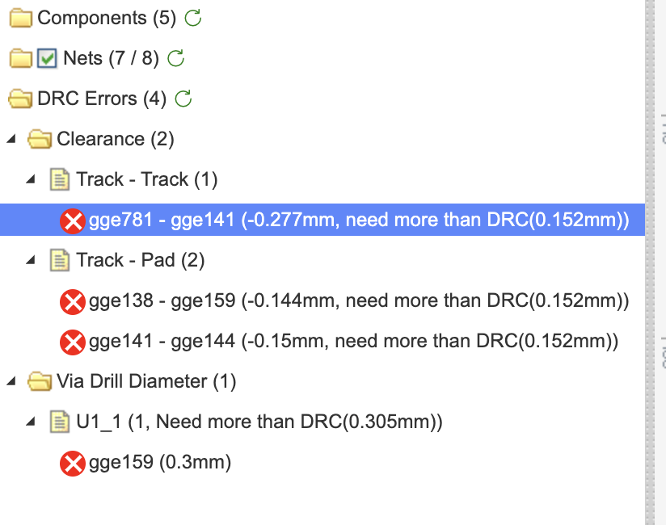
> 
> wrong 90deg routing
> 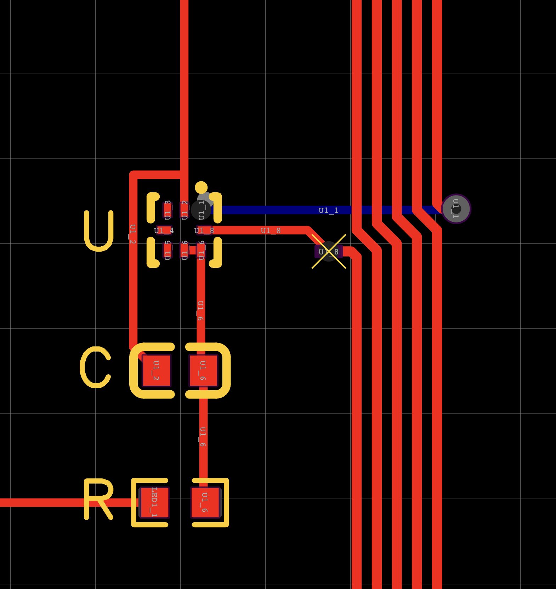

final routed pcb image:

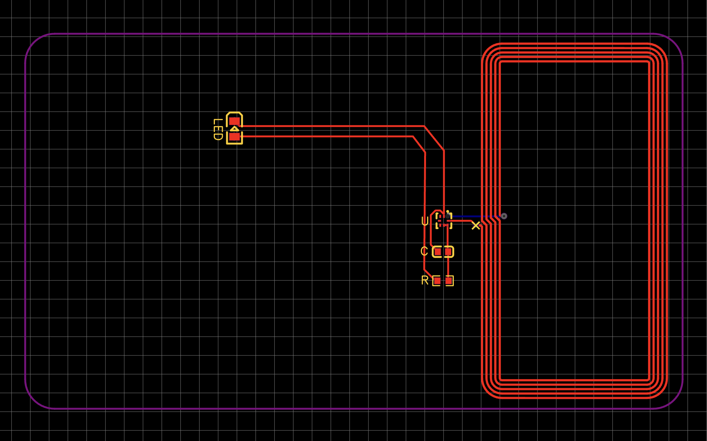
(still have the same drc errors shown above btw)

**Total time spent: 1 hour**

---
---

# Session 04: Working on PCB Art

to make the pcb art, i decided to use canva (easier than figma so...).
i got my images from pinterest mostly. i removed the background and tested with a few options (adjusted the settings while importing in easyeda, downloaded and edited the images a few times)

options i tried (screenshots of a few iterations): 

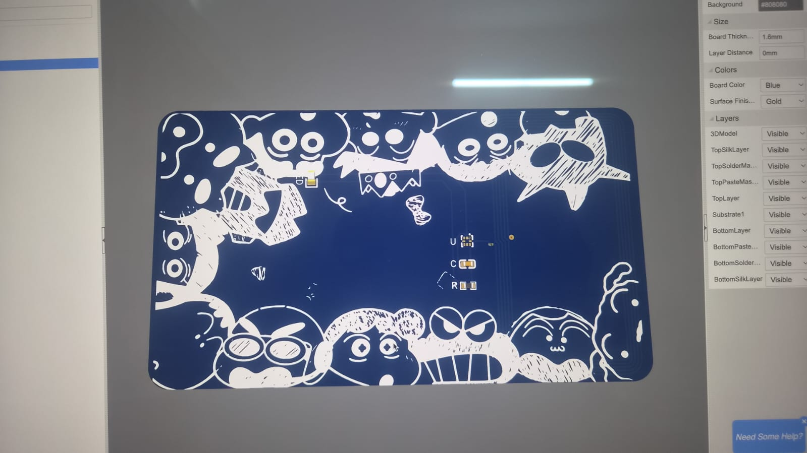
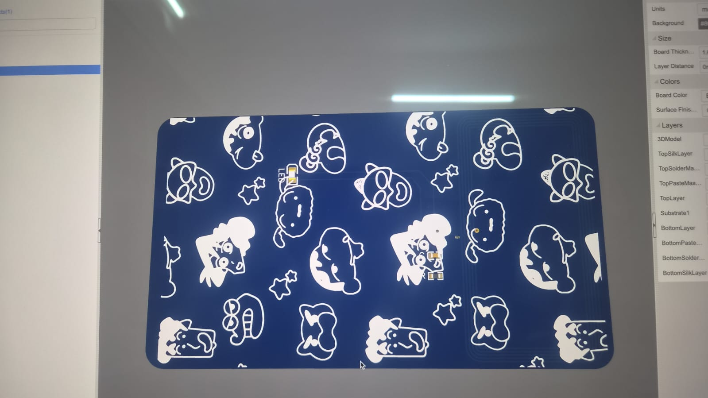
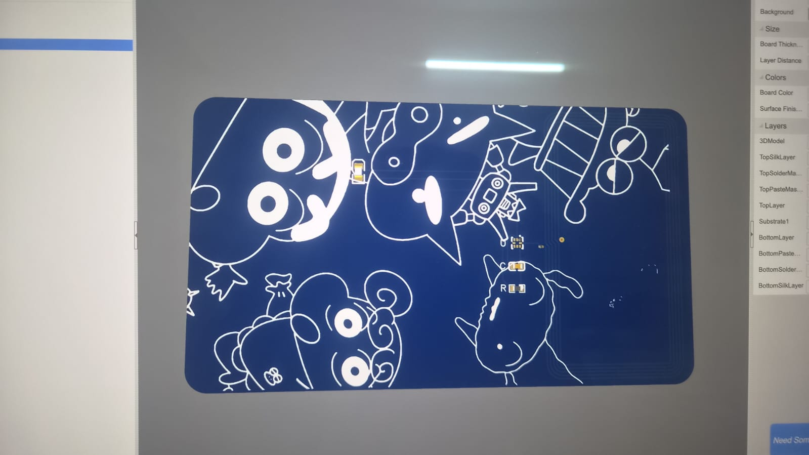
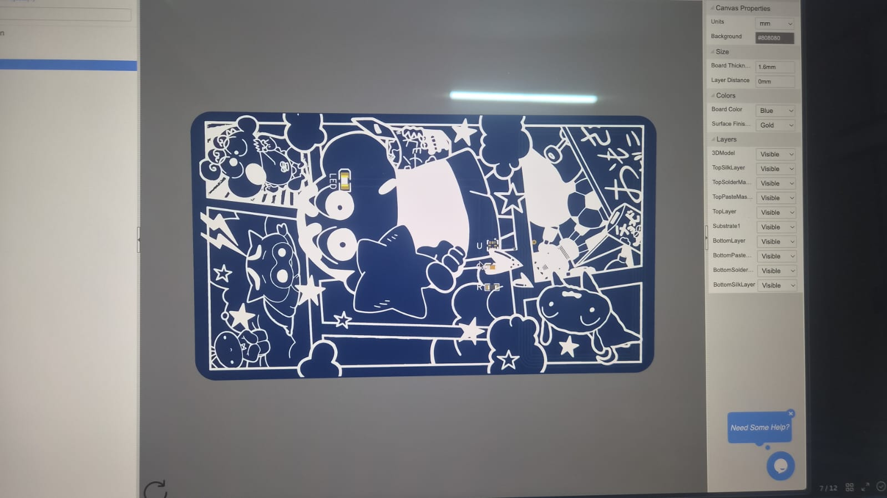
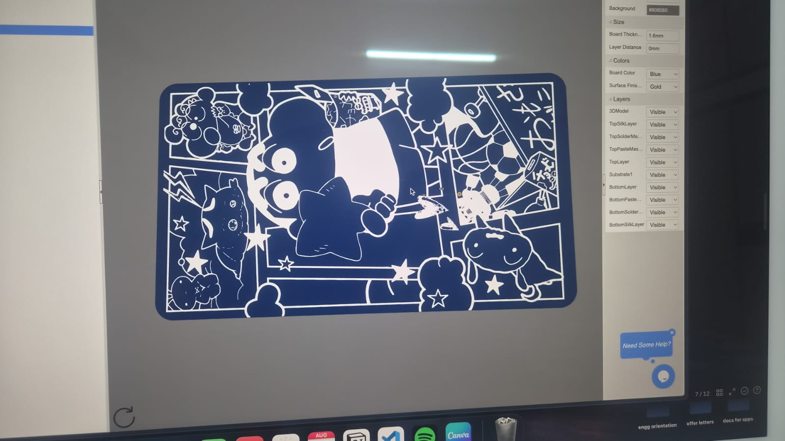

then i moved on to the front side of the card where i will put my social links etc.
i designed that also in canva and experimented with some different layouts (layout inspiration from pinterest as well)

finally i settled on this design:

front side
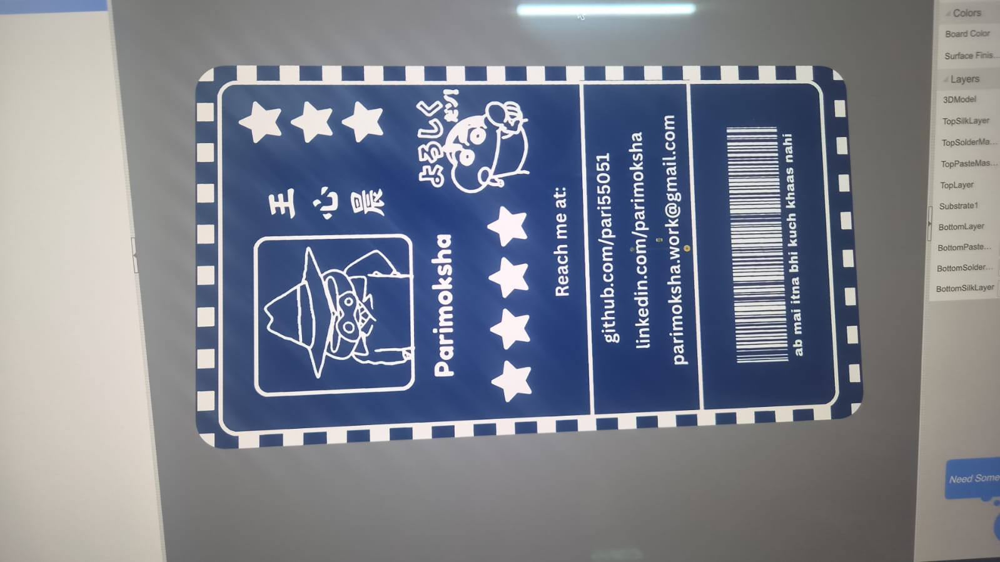

back side
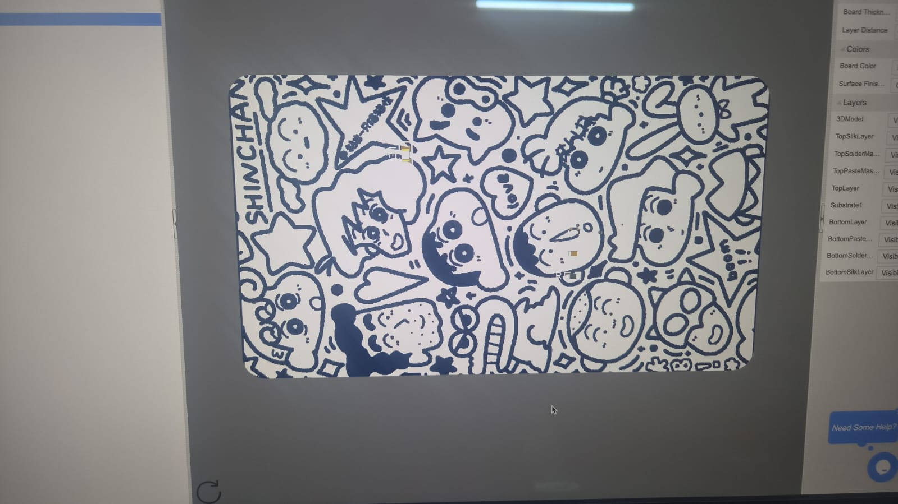

now i'm working on finalising the design where i'm planning to:
- properly resize the images to cover the card entirely
- put led on front side and rest components on back side => change routing (again)

**Total time spent: 1.5 hours**

---
---

# Session 05: Finalising the Design

so i made the final design by doing what i thought i will need to do. now i'll get it reviewed in slack foirst and then submit it full and final.

just as a re-cap this what i did:
- changed routing to make the led on the front side (actrual pcb's back side)
- re-adjusted the pcb art images to fit hr pcb better (i know it's overflowiung a bit in the images, however that's intentional) (had to do this a few times to get it just right)
- exported everything i needed (gerbers, bom, etc.)
- tried to configure the jlcpcb order

final pcb images:
schematic

routing
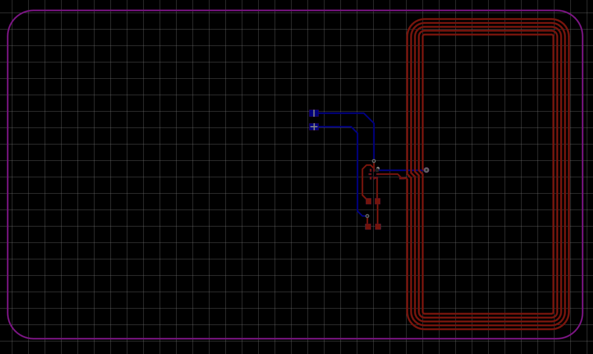

pcb design

> have disables top silk layer so that components are visible
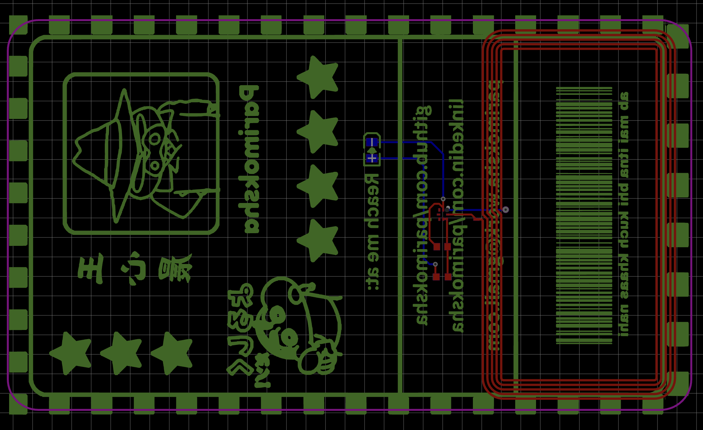

3d view
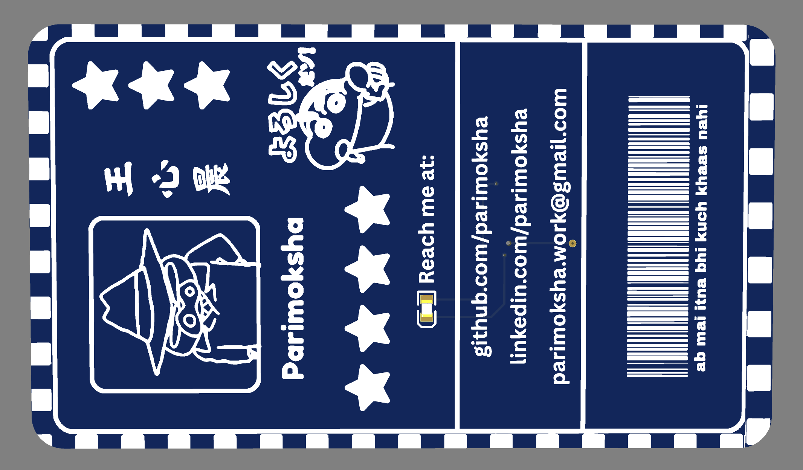
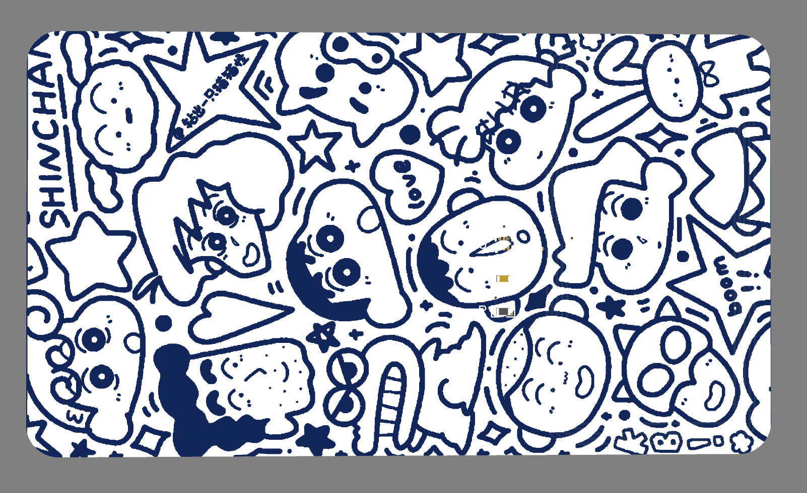

will now the readme and submit the project for review

**Total time spent: 0.3 hours (20min)**

---