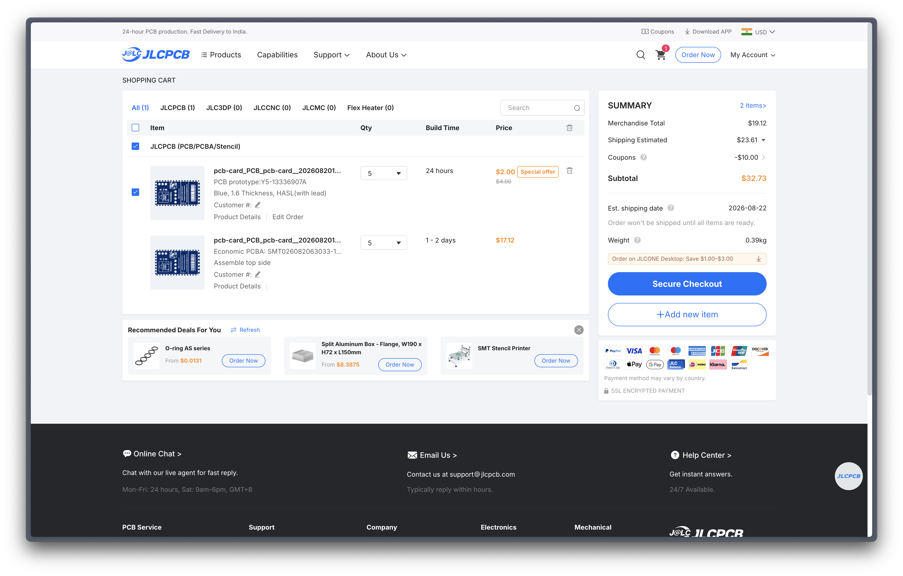

# Buri Buri PCB Card

it's like a business card, but pcb

## Description
this a pcb in shape of a business card to help me introduce myself in a cool way in hackathons

## Features
- nfc card to store my github profile link
- a led that glows by taking power from the nfc card
- my social links written on the pcb
- custom made cool design

## Images

#### 1. Schematic

#### 2. Routing

#### 3. PCB Design

#### 4. 3D view

## BOM

#### Components on PCB
| ID | Name                | Designator | Footprint                                | Quantity | Manufacturer Part | Manufacturer  | Supplier | Supplier Part | Price |
|----|---------------------|------------|------------------------------------------|----------|-------------------|---------------|----------|---------------|-------|
| 1  | 25X48MM_NFC_ANTENNA | 1          | 25X48MM_NFC_ANTENNA                      | 1        |                   |               |          |               |       |
| 2  | 220nF               | C          | C0603                                    | 1        | CL10B224KA8NNNC   | SAMSUNG(三星)   | LCSC     | C21120        | 0.017 |
| 3  | 17-21SUYC/TR8       | LED        | LED0805-R-RD                             | 1        | KT-0805黄灯         | KENTO         | LCSC     | C2296         | 0.012 |
| 4  | 47Ω                 | R          | R0603                                    | 1        | 0603WAF470JT5E    | UNI-ROYAL(厚声) | LCSC     | C23182        | 0.008 |
| 5  | NT3H2111W0FHKH      | U          | XQFN-8_L1.6-W1.6-P0.50-BL_NT3H2111W0FHKH | 1        | NT3H2111W0FHKH    | NXP(恩智浦)      | LCSC     | C710403       | 0.63  |

#### Overall PCB

| Merchandise Total | $9.12 | PCBA + pcb printing + components |
| Shipping Estimate | $23.61 | (cheapest shipping available) |
| **TOTAL** | $32.73 | - |

JLC PCBA Order - Cart Screenshot:

## Credits
- made by me
- pcb business card guide used: https://jams.hackclub.com/jam/hacker-card
- csv to markdown convertor (for converting bom.csv to md): https://tableconvert.com/csv-to-markdown
- image credits: all from pinterest (forgot to save the exact links though...)
- shoutout to all the people who answered my queries in slack